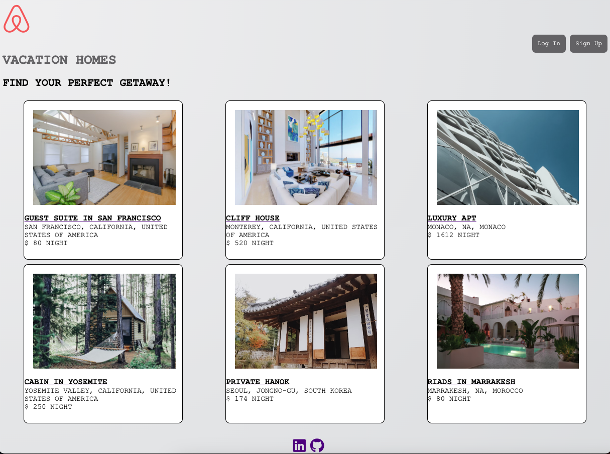

# Airbnb

Clone of Airbnb with the key features

## Technologies Used
- Node.js
- Express
- Sequelize
- Sqlite3
- React
- Redux
- Html5
- Css
- Git
- Javascript

## Features
- View listings
- Create listings
- Update their own listings
- Delete their own listings
- Read reviews
- Leave a review
- Delete a review

## How to setup the application from a fresh clone

### Install dependencies
- run "npm install"

### create .env file with the follwing
- PORT=8000
- DB_FILE=db/dev.db
- JWT_SECRET= FROM YOUR JWT TOKEN
- JWT_EXPIRES_IN=604800
- SCHEMA=airbnb_project

### Migrate and Seed the database
- run "npm rebuild"

### Start both the backend and frontend servers
- backend: npm start
- frontend: cd frontend && npm start